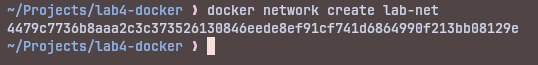

# Лабораторна робота №4: Контейнеризація сервісу (Docker)

## Автор

Помазан Роман, група АІ-233

## Модель

Метод Ньютона для розв’язання нелінійних рівнянь (5 семестр)

## Мета роботи

- Навчитися запускати програму у контейнері Docker  
- Ознайомитися з командами `docker build` та `docker run`  
- Налаштувати порти, змінні середовища та мережу контейнерів

## Файли проекту

- `main.py` — реалізація методу Ньютона  
- `Dockerfile` — інструкція для створення Docker-образу

## Як запустити

1. Зібрати Docker-образ:

```bash
docker build -t newton-method .
```

2. Створити мережу:

```bash
docker network create lab-net
```

3. Запустити контейнер з повними налаштуваннями:

```bash
docker run --rm \
  --name newton-method \
  -p 5000:5000 \
  -e STUDENT_NAME="Помазан Роман" \
  -e GROUP="АІ-233" \
  -e MODE="eco" \
  --network lab-net \
  newton-method
```

## Результати виконання

1. Збірка Docker-образу:


2. Налаштування Docker Network:



3. Запуск контейнера:


Модель успішно працює всередині Docker-контейнера. Використано режим `MODE=eco`.

## Висновки

У ході виконання лабораторної роботи №4 було успішно контейнеризовано обчислювальну модель «Метод Ньютона».
Створено Dockerfile, зібрано Docker-образ, налаштовано порти, змінні середовища (MODE, STUDENT_NAME, GROUP) та мережу контейнерів (lab-net).
Отримані практичні навички роботи з Docker, які будуть використані у наступних лабораторних роботах.
