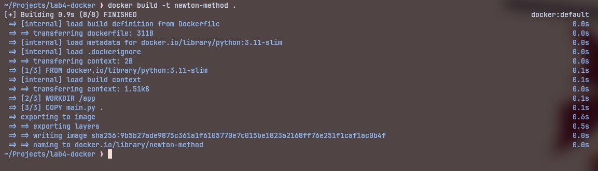
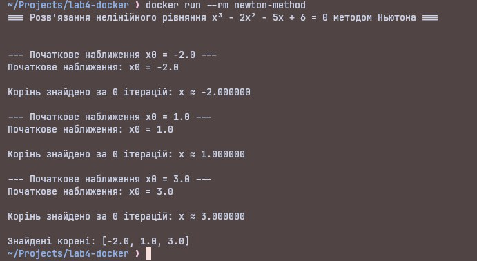

# Лабораторна робота №4: Контейнеризація сервісу (Docker)

## Автор

Помазан Роман, група АІ-233

## Модель

Метод Ньютона для розв’язання нелінійних рівнянь (5 семестр)

## Мета роботи

- Навчитися запускати програму у контейнері Docker  
- Ознайомитися з командами `docker build` та `docker run`  
- Налаштувати Docker-образ для обчислювальної моделі

## Файли проекту

- `main.py` — реалізація методу Ньютона  
- `Dockerfile` — інструкція для створення Docker-образу

## Як запустити

1. Зібрати Docker-образ:

```bash
docker build -t newton-method .
```

2. Запустити контейнер:

```bash
docker run --rm newton-method
```

## Результати виконання

1. Збірка Docker-образу:



2. Запуск контейнера:



Модель успішно працює всередині Docker-контейнера. Знаходження коренів нелінійного рівняння виконується коректно.

## Висновки

У ході виконання лабораторної роботи №4 було успішно контейнеризовано обчислювальну модель «Метод Ньютона».
Створено Dockerfile, зібрано Docker-образ newton-method та запущено контейнер. Код працює у ізольованому середовищі без залежності від локально встановлених пакетів Python.
Отримані практичні навички роботи з Docker, які будуть використані у подальших лабораторних.
